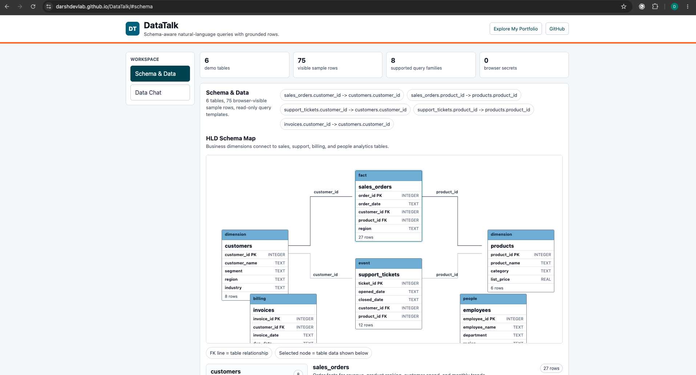
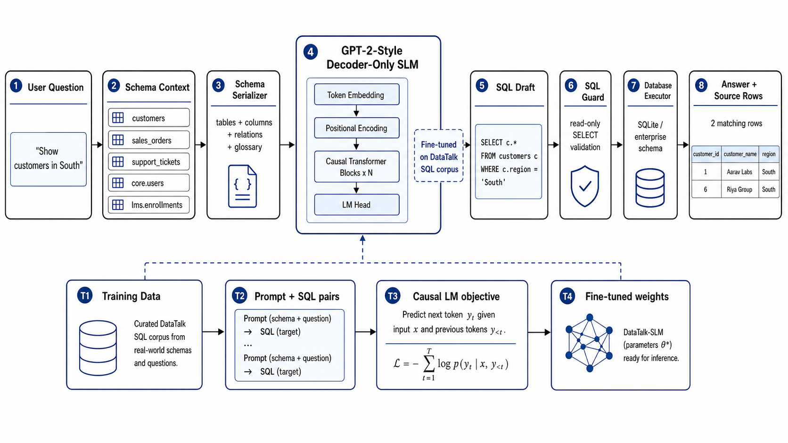
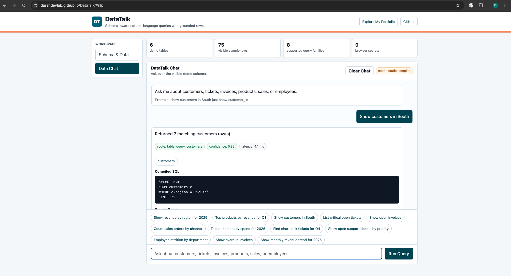

# DataTalk

DataTalk is a portfolio project for natural-language querying over company data.
It uses a constrained intent/slot compiler for reliable supported queries, plus
an experimental SLM training path for learning schema and question patterns.

**Live demo:** https://darshdevlab.github.io/DataTalk/



## What We Implemented

- Static GitHub Pages application with left-side workspace navigation
- Visual schema/data explorer with ERD-style table relationships
- Chat-style natural-language query interface with processing state
- Query history persistence in the browser for one active chat
- Clear Chat action that resets both visible and saved chat history
- Deterministic intent/slot compiler for supported company and LMS queries
- SQL preview, source rows, and visual checks for answer verification
- Read-only SQL validation boundary with no browser secrets
- Experimental SLM training and inference path for schema-aware text-to-SQL
- Public portfolio and GitHub links in the application header

Product discovery document:
[docs/product-discovery-document.md](docs/product-discovery-document.md)

## DataTalk-SLM Architecture

The SLM path is designed to specialize a compact model on schema, glossary, and
question-to-SQL patterns, while final correctness is still enforced by SQL
validation and source-row inspection.



## Application Views

### Schema & Data

The schema view exposes the demo tables, typed columns, relationship map,
business glossary, and sample rows so users can verify what the query engine can
answer.


### Data Chat

The chat view lets users ask natural-language questions, see the compiled SQL,
inspect result rows, and keep the current chat across refreshes.



## Why Train A Small Model

A generic LLM/RAG approach often sends the full schema, business definitions,
and examples on every question. DataTalk trains a small text-to-SQL model on the
company context so the runtime prompt can stay compact and local inference can
be faster.

The model should not memorize live business facts. The ML path is meant to learn:

- table and column meanings
- business terms such as revenue, attrition, churn-risk tickets, and overdue invoices
- common question-to-SQL patterns
- safe read-only SQLite output format

Correctness comes from compiled/read-only SQL, execution against the database,
and visible source rows.

## Quick Start

```bash
cd /Volumes/LocalDrive1/ProductPorfolio/Projects/DataTalk
python3 scripts/bootstrap_data.py --overwrite
python3 scripts/generate_training_data.py --count 1200
python3 scripts/query.py "Show revenue by region for 2025"
python3 scripts/compile_sql.py "Show active learners by organization"
python3 scripts/benchmark.py --iterations 3
python3 web_app.py --port 8765
```

Open:

```text
http://127.0.0.1:8765
```

## GitHub Pages Demo

The repository also includes a static GitHub Pages demo in `index.html`. The
left navigation opens a schema/data explorer with an ERD-style relationship map
or a chat-style query interface. Both views use the same embedded demo rows and
the supported intent compiler in browser JavaScript, so there are no browser
secrets and no backend token is required.

Live demo:

```text
https://darshdevlab.github.io/DataTalk/
```

Local preview:

```bash
python3 -m http.server 8080
```

Open:

```text
http://127.0.0.1:8080
```

## Compiler Evaluation

The reliable demo path maps supported questions to intent/slots, then compiles
SQL deterministically.

```bash
python3 scripts/build_domain_training_corpus.py
python3 scripts/evaluate_compiler.py
```

The compiler supports company SQLite intents such as revenue by region, top
products, top customers, support tickets, attrition, overdue invoices, and
monthly revenue. It also supports schema-qualified LMS SQL examples using
tables such as `core.users`, `lms.enrollments`, `billing.invoices`, and
`analytics.events`.

## Train The Experimental SLM

Create an environment and install training dependencies:

```bash
cd /Volumes/LocalDrive1/ProductPorfolio/Projects/DataTalk
python3 -m venv .venv
source .venv/bin/activate
pip install -r requirements-train.txt
python scripts/build_training_corpus.py
python train_slm.py --epochs 3 --batch-size 2 --gradient-accumulation-steps 8
```

The trained model is saved to:

```text
artifacts/models/flan-t5-small-datatalk
```

Run queries through the trained model:

```bash
python scripts/query.py "Top products by revenue for Q1" --model-dir artifacts/models/flan-t5-small-datatalk
python scripts/benchmark.py --model-dir artifacts/models/flan-t5-small-datatalk --iterations 3
```

Run the UI with the trained model:

```bash
DATATALK_MODEL_DIR=artifacts/models/flan-t5-small-datatalk python web_app.py --port 8765
```

## Benchmark Claim

The honest claim to test is:

> A company-specific SLM can reduce per-query context size and run faster than a
> generic full-context LLM prompt, while still returning grounded SQL-backed
> answers.

DataTalk should report:

- model or router mode
- average latency
- p95 latency
- SQL validation failures
- row counts
- executed SQL
- answer text

Do not claim the experimental SLM is always correct. The UI and CLI always show
SQL and source rows so users can inspect the answer.

## GitHub Packaging

Generated datasets, train/validation/test JSONL files, SQLite databases, model
weights, and reports are ignored by `.gitignore`. Commit source code, README,
requirements, scripts, and small examples only.

Included example questions:

```text
examples/test_questions.json
```

Regenerate local artifacts after cloning:

```bash
python3 scripts/bootstrap_data.py --overwrite
python3 scripts/build_domain_training_corpus.py
python3 scripts/evaluate_compiler.py
```

## Free Hugging Face Space Deployment

The public API can run on the free Hugging Face Spaces CPU environment. The
deployable Space files live in:

```text
deploy/hf_space/
```

Deploy after logging in with a Hugging Face write token:

```bash
huggingface-cli login
python3 deploy/deploy_hf_space.py --repo-id DarshDev/DataTalk
```

Or use an environment token:

```bash
export HF_TOKEN=hf_your_write_token
python3 deploy/deploy_hf_space.py --repo-id DarshDev/DataTalk
```

Expected URLs:

```text
https://huggingface.co/spaces/DarshDev/DataTalk
https://darshdev-datatalk.hf.space
https://darshdev-datatalk.hf.space/health
https://darshdev-datatalk.hf.space/query
```

## Project Structure

```text
DataTalk/
  datatalk/
    config.py
    data.py
    executor.py
    intent_compiler.py
    lms_schema.py
    model_sql.py
    prompts.py
    router.py
    schema.py
    sql_guard.py
  scripts/
    bootstrap_data.py
    benchmark.py
    build_domain_training_corpus.py
    build_training_corpus.py
    generate_training_data.py
    compile_sql.py
    evaluate_compiler.py
    evaluate_text_to_sql_model.py
    query.py
  examples/
    test_questions.json
  train_slm.py
  web_app.py
  requirements.txt
  requirements-train.txt
```
